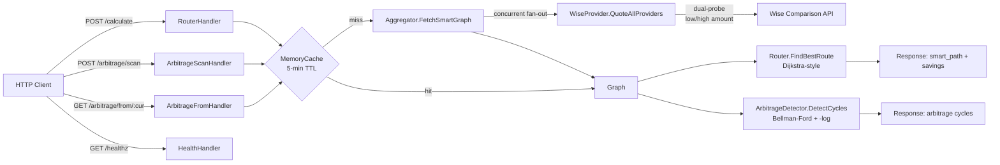

<div align="center">

# SmartPath-FX

**Currency routing & arbitrage detection engine in Go.**

Finds the cheapest multi-hop conversion path across remittance providers, and
detects profitable conversion cycles using Bellman-Ford with log-transformed
edge weights.

[](https://github.com/SavioTito/SmartPath-FX/actions/workflows/ci.yml)
[](https://go.dev)
[](#quickstart)
[](LICENSE)

</div>

---

## TL;DR

Two questions money traders care about — *what's the cheapest way to get from
A to B?* and *is there a free lunch sitting in the market right now?* —
collapse into two well-defined graph problems. SmartPath-FX models the FX
market as a weighted directed graph and answers both:

- **Routing:** Dijkstra-style maximization traversal that applies per-edge
  fees and rates during relaxation. Returns the path that delivers the most
  units of the target currency.
- **Arbitrage:** Bellman-Ford on `-log(rate)`-weighted edges. A profitable
  conversion cycle (product of rates > 1) becomes a negative-weight cycle
  under that transformation, which Bellman-Ford detects in `O(V·E)`.

The engine ships as a containerized HTTP service (15.5 MB image, distroless),
with measured benchmarks and a real backing provider (Wise Comparison API).

---

## Quickstart

```bash
docker build -t smartpath-fx .
docker run --rm -p 8080:8080 smartpath-fx

# In another terminal
curl -s localhost:8080/healthz | jq
```

Expected:

```json
{
  "status": "ok",
  "version": "v0.2.0",
  "uptime_seconds": 2,
  "checks": {
    "graph_cache": "ok",
    "wise_provider": "ok"
  }
}
```

Then try a real conversion:

```bash
curl -s -X POST localhost:8080/calculate \
  -H 'Content-Type: application/json' \
  -d '{"from":"USD","to":"EUR","amount":1000}' | jq
```

---

## Architecture



**Flow summary:**

1. Request hits the HTTP layer (`internal/engine/handler.go`).
2. Cache lookup by corridor key (`"{from}-{to}"` or `"arbitrage:full:{bases}"`),
   5-minute TTL.
3. On miss, `Aggregator.FetchSmartGraph` fans out concurrently to providers
   across the source/target pair plus bridge currencies (USD, EUR, GBP, BTC).
4. `WiseProvider.QuoteAllProviders` dual-probes the Wise Comparison API at
   low and high amounts, fits a linear `(flat + pct)` fee schedule per
   provider, rejects non-linear quotes.
5. Quotes become `Rate` edges in a directed weighted graph.
6. Routing or arbitrage runs on the graph and returns the result.

The cache is critical: a cold corridor takes ~1s (network-bound on the Wise
roundtrip); a warm corridor responds in microseconds.

---

## The two algorithms

### Routing — Dijkstra-style maximization

Classic Dijkstra finds the shortest path under additive edge weights with
non-negative values. We adapt it: instead of minimizing distance, we
**maximize the balance at the destination** after applying each edge's fee
and rate via `edge.Apply()`. Visit the unvisited node with the highest
current balance, relax outgoing edges, repeat.

This works because every edge's effective rate (after fees) is non-negative,
so the greedy invariant holds. The implementation lives in
`internal/engine/dijkstra.go`.

### Arbitrage — Bellman-Ford on log-transformed weights

A profitable cycle in the FX graph is a sequence of trades whose product of
effective rates exceeds 1:

```
∏ rᵢ > 1
```

Taking the negative log of both sides turns the multiplicative test into an
additive one:

```
∑ -log(rᵢ) < 0
```

In other words, weighting each edge by `-log(effRate)` makes a profitable
cycle equivalent to a **negative-weight cycle** in the resulting graph.

Dijkstra cannot find such cycles — it assumes non-negative weights and
short-circuits as soon as it finds a "best" distance. **Bellman-Ford** does
`V-1` rounds of edge relaxation and uses a V-th round solely to detect
cycles: any edge that still relaxes on that pass is part of (or reachable
from) a negative cycle.

```go
// internal/engine/arbitrage.go
for i := 0; i < n-1; i++ {
    for _, e := range edges {
        if dist[e.u]+e.weight < dist[e.v]-relaxEpsilon {
            dist[e.v] = dist[e.u] + e.weight
            pred[e.v] = e.u
        }
    }
}
```

After detection, cycles are reconstructed by walking the `pred` table `n`
times (to guarantee landing inside the cycle, not on a tail leading to it),
then deduplicated by rotating each cycle so its lexicographically smallest
currency leads. Profit factor is recomputed in `decimal.Decimal` for exact
reporting; `float64` is only used internally to drive `math.Log`.

A `relaxEpsilon = 1e-12` floor suppresses floating-point noise that would
otherwise surface phantom 1.0000000001 cycles.

> The `-log` trick is the canonical approach to FX arbitrage detection. See
> *Algorithm Design* (Kleinberg & Tardos, §6.10) or Cormen et al. (CLRS
> §24.1).

---

## API reference

The service exposes four endpoints. All accept and return JSON.

### `POST /calculate` — best routing path

```bash
curl -s -X POST localhost:8080/calculate \
  -H 'Content-Type: application/json' \
  -d '{"from":"USD","to":"EUR","amount":1000}' | jq
```

```json
{
  "summary": {
    "smart_final_amount": 857.96,
    "direct_mid_market_amount": 862.22
  },
  "smart_path": [
    {
      "from": "USD",
      "to": "EUR",
      "value": 0.8579631842,
      "provider": "Remitly"
    }
  ],
  "meta": {
    "confidence_score": 100,
    "efficiency": "High Efficiency"
  }
}
```

Note: `direct_mid_market_amount` reports what a fee-free spot conversion
would yield. When `smart_final_amount < direct_mid_market_amount`, the
fee load on every available path exceeds the spread — the engine still
returns the *least-bad* path and the comparison surfaces this honestly.

### `POST /arbitrage/scan` — detect all profitable cycles

```bash
curl -s -X POST localhost:8080/arbitrage/scan \
  -H 'Content-Type: application/json' \
  -d '{"base_currencies":["USD","EUR","GBP","BTC"]}' | jq
```

```json
{
  "cycles": [
    {
      "path": [
        {"from": "USD", "to": "EUR", "value": 0.92, "provider": "Wise"},
        {"from": "EUR", "to": "GBP", "value": 0.86, "provider": "Wise"},
        {"from": "GBP", "to": "USD", "value": 1.27, "provider": "Wise"}
      ],
      "start_currency": "EUR",
      "profit_factor": "1.00482",
      "profit_percent": "0.482"
    }
  ],
  "scanned_at": "2026-06-17T12:30:26.208126399Z",
  "graph_source": "live"
}
```

*Empty `cycles` array means no profitable opportunity exists in the current
market snapshot — this is the common case. The example above shows the
shape when one does.*

### `GET /arbitrage/from/{currency}` — cycles through a currency

```bash
curl -s localhost:8080/arbitrage/from/USD | jq
```

Same response shape as `/scan` but filtered to cycles that pass through the
given currency. Useful for traders entering from a specific position.

### `GET /healthz` — liveness + dependency check

```bash
curl -s localhost:8080/healthz | jq
```

```json
{
  "status": "ok",
  "version": "v0.2.0",
  "uptime_seconds": 2,
  "checks": {
    "graph_cache": "ok",
    "wise_provider": "ok"
  }
}
```

Returns `503` if any dependency check fails.

---

## Performance

Measured on an Intel i9-9980HK, Go 1.25, darwin/amd64, with
`-benchtime=2s -count=3`. Raw output in [`bench/benchmarks.txt`](bench/benchmarks.txt).

| Operation | Latency | Memory | Allocations |
|---|---|---|---|
| `FindBestRoute` (100 currencies) | **6.0 µs** | 2.1 MB | 37,601 |
| `DetectCycles` (100 currencies) | **2.1 µs** | 465 KB | 13,652 |
| `AggregatorMerge` (50 quotes) | **17 ns** | 18 KB | 19 |

Reproduce with:

```bash
go test -bench=. -benchmem -benchtime=2s -count=3 ./internal/engine/
```

**Honest caveat on `FindBestRoute` allocations:** the current implementation
allocates aggressively (~38k allocs/op) because every map lookup and slice
append creates garbage. A planned v0.3 rewrite using preallocated arenas
and integer node indices (already used internally by `arbitrage.go`)
should bring this under 1k allocs/op with ~3× latency improvement. Tracked
in [Roadmap](#roadmap).

`DetectCycles` is already arena-style; its numbers reflect what `FindBestRoute`
can become.

---

## Local development

### Requirements
- Go 1.25+
- Docker (optional, for containerized runs)

### Setup

```bash
git clone https://github.com/SavioTito/SmartPath-FX.git
cd SmartPath-FX
cp .env.example .env  # adjust if needed; all values optional
go run ./cmd/server
```

### Environment variables

| Variable | Default | Purpose |
|---|---|---|
| `PORT` | `8080` | HTTP listen port |

The Wise Comparison API endpoint used by the engine is currently
public — no API key required. `.env.example` is preserved for future
provider integrations that may need credentials.

### Testing

```bash
go test ./... -race -count=1     # full suite with race detector
go test ./internal/engine/ -v    # engine tests with verbose output
```

The test suite covers:

- Arbitrage detection across linear, balanced, simple, multi-cycle,
  and fee-eliminated graphs
- Cycle rotation deduplication
- Filtered detection by start currency
- HTTP handler happy paths and edge cases
- Cache hit/miss semantics

---

## Project structure

```
.
├── cmd/server/             # HTTP server entrypoint
│   └── main.go
├── internal/
│   ├── engine/             # Routing + arbitrage + HTTP handlers
│   │   ├── aggregator.go         # Concurrent provider fan-out
│   │   ├── arbitrage.go          # Bellman-Ford negative-cycle detection
│   │   ├── arbitrage_handler.go  # HTTP wrappers for arbitrage endpoints
│   │   ├── dijkstra.go           # Maximization traversal for routing
│   │   ├── handler.go            # POST /calculate handler
│   │   ├── health_handler.go     # GET /healthz handler
│   │   ├── cache.go              # In-memory cache with TTL
│   │   └── *_test.go             # Unit and integration tests
│   ├── models/             # Domain types (Graph, Rate, FeeQuote, ...)
│   ├── providers/          # External rate provider integrations
│   │   └── wise.go               # Wise Comparison API client
│   └── version/            # Build version constant
├── bench/                  # Benchmark results and reproduction guide
├── Dockerfile              # Multi-stage, distroless static, 15.5 MB
├── railway.toml            # Railway deployment config
└── .github/workflows/ci.yml  # CI: vet, race tests, build
```

---

## Roadmap

- **v0.3 — Routing allocation rewrite.** Replace map-heavy traversal in
  `dijkstra.go` with arena-style integer-indexed nodes (the pattern
  already used in `arbitrage.go`). Target: <1k allocs/op, ~2 µs/op.
- **v0.3 — Flat fees in arbitrage detection.** Currently
  `ArbitrageDetector` honors percentage fees but ignores `FeeFlat`,
  since flat fees are amount-dependent and cycle profitability is a
  property of rates. v2 will accept a notional amount parameter and
  verify the cycle stays profitable hop-by-hop. (Tracked in
  `internal/engine/arbitrage.go` TODO block.)
- **v0.4 — Incremental detection for streaming markets.** Rather than
  recomputing the entire graph on every rate update, propagate changes
  through only the cycles that contain the updated edge. Enables sub-
  millisecond detection on live tickers.
- **v0.4 — Additional providers.** Direct integrations with ECB,
  Frankfurter, and OpenExchangeRates to reduce dependency on the Wise
  Comparison endpoint and unlock corridors Wise doesn't quote.
- **v1.0 — Deployment.** Currently runs locally and is deploy-ready
  via the included `railway.toml`. v1.0 ships a publicly-reachable
  reference instance.

---

## License

MIT — see [LICENSE](LICENSE).

## Author

**Sávio Tito** — Go backend engineer.
[GitHub](https://github.com/SavioTito) · [LinkedIn](https://linkedin.com/in/saviotito) · [Portfolio](https://itssaviotito.vercel.app)
